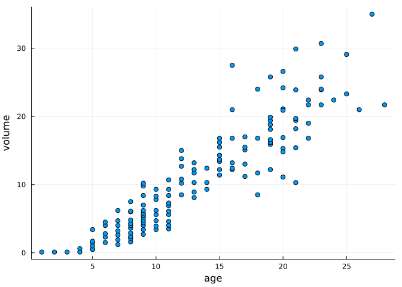
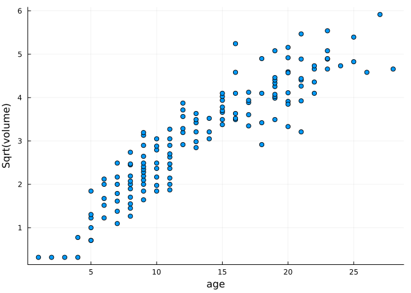
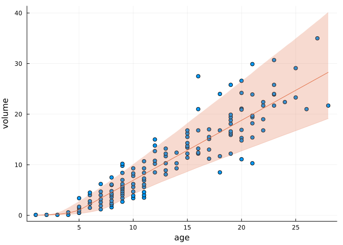

# Laplace approximation to fit random effects models in Julia
Sean L. Wu
2025-06-19

- [Urchin model](#urchin-model)
- [Laplace Approximation for MLE with Random
  Effects](#laplace-approximation-for-mle-with-random-effects)
- [Loading Data](#loading-data)
- [Julia Implementation](#julia-implementation)
- [Simulating from Sampling
  Distribution](#simulating-from-sampling-distribution)

In this notebook we’ll see how to use
[DifferentiationInterface.jl](https://github.com/JuliaDiff/DifferentiationInterface.jl)
with Julia’s other facilities for optimization to estimate a statistical
model of realistic complexity. The example chosen from Simon Wood’s book
[Core Statistics](https://www.maths.ed.ac.uk/~swood34/), available for
free on his website (click the link and scroll down), described on pp
99-111. The original implementation was in R, the Julia implementation
in some cases is similar but differs in other cases, most obviously by
using automatic differentiation to replace the mixture of symbolic
differentiation (via the somewhat awkward `expr` interface) and finite
differencing from the R code. This method of maximum likelihood
estimation (MLE) via a Laplace approximation is generic across a wide
variety of models, and hopefully should be easy to follow for R users
who wish to adopt Julia.

## Urchin model

The model is one of sea urchin growth. There is a mechanistic model to
relate volume $V$ to age $a$ by the differential equation:

$$
\frac{dV}{da} = \begin{cases}
    g_{i} V, & V < p_{i}/g_{i} \\
    p_{i} & \text{otherwise}
\end{cases}
$$

This is an “individual-based” model, because the growth parameters $p$
and $g$ are indexed by the individual urchin. In the statistical model
sitting “on top” of the mechanistic model, these are *random effects*.
Each urchin has an initial condition for the ODE (initial volume) which
is $\omega$, a fixed effect common to all urchins. The differential
equation changes when the animal hits reproductive age, which is:

$$
a_{mi} = \frac{1}{g_{i}}\log\left( \frac{p_{i}}{g_{i}\omega}\right)
$$

The ODE has the analytical solution:

$$
V(a) = \begin{cases}
    \omega \exp(g_{i} a_{i}), & a_{i} < a_{mi} \\
    p_{i}/g_{i} + p_{i}(a_{i}-a_{mi}) & \text{otherwise}
\end{cases}
$$

The measured urchin volumes are $v$, and the likelihood model is:

$$
\sqrt v_{i} \sim N(\sqrt{V(a_{i})},\sigma^{2})
$$

And we assume the random effects follow:

$$
\begin{split}
\log g_{i} \sim N(\mu_{g},\sigma_{g}^{2}) \\
\log p_{i} \sim N(\mu_{p},\sigma_{p}^{2})
\
\end{split}
$$

The model parameters (“fixed effects”) are
$\omega, \mu_{g}, \sigma_{g}, \mu_{p}, \sigma_{p}, \sigma$, and the
random effects are $g, p$.

## Laplace Approximation for MLE with Random Effects

When we fit statistical models with fixed and random effects, we need to
optimize the marginal density of the data with respect to the fixed
effects $\theta$, integrating out the random effects $b$. Letting the
joint density be $f_{\theta}(y,b)$ of the data $y$, random effects $b$,
the marginal likelihood is:

$$
L(\theta) = f_{\theta}(y) = \int f_{\theta}(y,b) db
$$

A first order Laplce approximation will approximate the integral with
another expression. For details of the derivation, see the book chapter.
The important point is that the approximate marginal likelihood is much
easier to calculate. Let $\hat{b}_{y}$ be the value of $b$ maximizing
$f_{\theta}(y,b)$, and $n_{b}$ be the dimension of $b$. Let
$H = -\nabla^{2}_{b} \log f_{\theta}(y,\hat{b}_{y})$. Then the
approximation of the likelihood is:

$$
f_{\theta}(y,b) \approx f_{\theta}(y,\hat{b}_{y}) \frac{(2\pi)^{n_{b}/2}}{|H|^{1/2}}
$$

We will work with the negative log likelihood in practice. It is this
approximation that we will implement and optimize for approximate
maximum likelihood estimation of $\theta$ in this notebook.

## Loading Data

We are going to load the data from Simon Wood’s website.

``` julia
using CSV, HTTP, DataFrames

http_response = HTTP.request("GET", "https://www.maths.ed.ac.uk/~swood34/data/urchin-vol.txt")
urchins = CSV.read(IOBuffer(http_response.body), DataFrame, header=["row", "age", "vol"], skipto=2)
select!(urchins, Not(:row))
```

We can take a look at it:

``` julia
using Plots

scatter(urchins.age,urchins.vol,label=false,xlabel="age",ylabel="volume")
```



If we square root transform the input data we can see that the
likelihood model’s assumption of constant variance is probably not too
bad, although we’d want to fix it for “real” modeling.

``` julia
scatter(urchins.age,sqrt.(urchins.vol),label=false,xlabel="age",ylabel="Sqrt(volume)")
```



## Julia Implementation

We will use
[DifferentiationInterface.jl](https://github.com/JuliaDiff/DifferentiationInterface.jl)
to handle the hard work of calculating the gradients and Hessians we
will need to compute the Laplace approximation of the likelihood and fit
the resulting approximate model for inference. We’ll load the packages
we need below. For automatic differentiation (AD) we’ll use the slow but
reliable method of forward automatic differentiation, although
DifferentiationInterface.jl makes it nearly trivial to change AD
backends.

``` julia
using LinearAlgebra, Distributions
using Optim, LineSearches
using DifferentiationInterface
import ForwardDiff

# for sparse AD
using SparseMatrixColorings
import Symbolics
using SparseArrays

const ad_sys = AutoForwardDiff()
```

### Model and Likelihood

We need to pass the fixed and random effects as single vectors, so it’s
useful to define helper variables to index into them. It will be helpful
to have, so we also define reasonable starting values for $\theta$ and
$b$.

``` julia
# index into a single vector for b (random effects)
const log_g_ix = 1:nrow(urchins)
const log_p_ix = range(start=nrow(urchins)+1, length=nrow(urchins))

# index into a single vector for θ (fixed effects)
const log_ω_ix = 1
const μ_g_ix = 2
const log_σ_g_ix = 3
const μ_p_ix = 4
const log_σ_p_ix = 5
const log_σ_ix = 6

# initial starting values for Θ
th_init = [
    -4.0,
    -0.2, 
    log(0.1),
    0.2,
    log(0.1),
    log(0.5)
]

# initial starting values for b
b_init = [
    fill(th_init[μ_g_ix], nrow(urchins)); fill(th_init[μ_p_ix], nrow(urchins))
]
```

Now let’s define the biological model, and the negative log likelihood
of $y$ and $b$, $-\log f_{\theta}(y,b)$. We will need both the gradient
and the Hessian of the negative log likelihood to find $\hat{b}_{y}$ for
a given value of $\theta$, and the Hessian for the Laplace approximation
of the marginal likelihood of $\theta$ for optimization, so we also
prepare the data objects which will be reused for multiple evaluations
of the gradient/Hessian to improve performance.

Note that we take advantage of sparsity in the Hessian by using
DifferentiationInterface.jl’s support for sparse Hessian computations.
In particular, we don’t need to input a sparsity pattern, we can just
let other packages figure it out!

``` julia
function model_urchin_vol(ω, g, p, a)
    aₘ = log(p / (g*ω))/g    
    return ifelse(a < aₘ, ω*exp(g*a), p/g + p*(a-aₘ))
end

function nll_urchin(b, θ, urchin)
    # extract fixed effects
    σ = exp(θ[log_σ_ix])
    σ_g = exp(θ[log_σ_g_ix])
    σ_p = exp(θ[log_σ_p_ix])
    ω = exp(θ[log_ω_ix])
    # extract random effects
    log_g = b[log_g_ix]
    log_p = b[log_p_ix]
    # calculate the loglikelihood of y and b
     logll = 0.0
     for i in axes(urchin,1)
          v = model_urchin_vol(ω, exp(log_g[i]), exp(log_p[i]), urchin[i, :age])
          logll += logpdf(Normal(sqrt(v), σ), sqrt(urchin[i, :vol]))
          logll += logpdf(Normal(θ[μ_g_ix], σ_g), log_g[i])
          logll += logpdf(Normal(θ[μ_p_ix], σ_p), log_p[i])
     end
     return -logll
end

const prep_g_nll = prepare_gradient(nll_urchin, ad_sys, zero(b_init), Constant(th_init), Constant(urchins))

const sp_ad_sys = AutoSparse(
    ad_sys;
    sparsity_detector=Symbolics.SymbolicsSparsityDetector(),
    coloring_algorithm=GreedyColoringAlgorithm(),
)
const prep_sp_h_nll = prepare_hessian(nll_urchin, sp_ad_sys, rand(length(b_init)), Constant(th_init), Constant(urchins))
```

### Perturbing the Hessian

In the R code written by Simon Wood, a function `pdR` was provided which
perturbs the returned Hessian (in R evaluated via finite differencing)
if it is not positive definite such that the returned matrix is positive
definite, which is needed to fulfill assumptions in the approximation.
We replicate this in Julia, although due to some complexities with how
Cholesky factorizations are computed when the input is a sparse matrix,
we write a specific method for sparse input.

``` julia
function cholesky_check(m)
     try
          sparse(cholesky(m))
     catch
         nothing
     end
end

function cholesky_check(m::T) where {T<:SparseMatrixCSC}
     try
          # thanks to https://discourse.julialang.org/t/how-to-get-upper-triangular-cholesky-factor-of-sparse-matrix/129979/2?u=slwu89
          C = cholesky(m)
          perm = C.p
          invperm_vec = invperm(perm)
          L = sparse(C.L)[invperm_vec, invperm_vec]
          L'
     catch
         nothing
     end
end
 
function pdR(H, k_mult=20, tol=eps()^.8)
     k=1
     tol = tol * opnorm(H, 1)
     n = size(H, 2)
     R = cholesky_check(H + (k-1)*tol*I(n))
     while isnothing(R)
         k *= k_mult
         R = cholesky_check(H + (k-1)*tol*I(n))
     end
     return R
end
```

### Marginal Log Likelihood

Now we’re ready to write our Laplace approximation of $L(\theta)$.
First, we make an object `b_cache` which will store the values of
$\hat{b}_{y}$ from iteration to iteration, which speeds up optimization
slightly by letting the solver start from a good location in parameter
space, and also because occasionally the estimates of $b$ are of
interest to the modeler.

Note that within the approximation of $L(\theta)$ we first find
$\hat{b}_{y}$ via Newton’s method. We then get
$- \log f_{\theta}(y,\hat{b}_{y})$. Taking the Hessian at $\hat{b}_{y}$
allows us to compute the remaining log determinant term needed for the
Laplace approximation.

``` julia
const b_cache = deepcopy(b_init)

function marginal_nll(θ)
     # the `llu` function from Wood's R code
     nb = length(b_cache)

     g_nll!(G, b) = gradient!(nll_urchin, G, prep_g_nll, ad_sys, b, Constant(θ), Constant(urchins))
     H_nll!(H, b) = hessian!(nll_urchin, H, prep_sp_h_nll, sp_ad_sys, b, Constant(θ), Constant(urchins))

     nlfyb_optim = optimize(
          b -> nll_urchin(b, θ, urchins), 
          g_nll!,
          H_nll!,
          b_cache, 
          Newton(;alphaguess=InitialStatic(scaled=true), linesearch=BackTracking())
     )
     b_hat = Optim.minimizer(nlfyb_optim)
     nll_hat = Optim.minimum(nlfyb_optim)

     b_cache .= b_hat # updated cached value for next iteration

     H = hessian(nll_urchin, prep_sp_h_nll, sp_ad_sys, b_hat, Constant(θ), Constant(urchins))  
     R = pdR(H)
     
     return nll_hat + logdet(R) - log(2π)*(nb/2)
end
```

### Optimization

Now we’re ready to optimize $L(\theta)$ with respect to $\theta$ to find
the MLE estimates of the fixed effect parameters. For the outer
optimziation of $L(\theta)$, we will use finite differentiation to get a
search gradient, because most AD packages have difficulty
differentiating through nested optimization calls. We compute the AIC of
the fitted model, which is roughly equivalent to the R implementation,
and return the $\hat{\theta}$ vector.

``` julia
const fd_sys = AutoFiniteDiff()
marginal_nll_prep = prepare_gradient(marginal_nll, fd_sys, rand(length(th_init)))
g_marginal_nll!(G, θ) = gradient!(marginal_nll, G, marginal_nll_prep, fd_sys, θ)

marginal_mle = optimize(
     marginal_nll,
     g_marginal_nll!,
     th_init,
     LBFGS(;alphaguess=InitialStatic(scaled=true), linesearch=BackTracking())
)

# model AIC
aic = 2*Optim.minimum(marginal_mle) + 2*length(th_init)
```

    196.65433941164576

``` julia
theta_hat = Optim.minimizer(marginal_mle)
```

    6-element Vector{Float64}:
     -3.8209363719659635
     -0.24650595062193945
     -1.818444737639711
      0.16975727067150495
     -1.6277268858566873
     -1.1306834470971574

## Simulating from Sampling Distribution

To get some notion of what the sampling distribution of reasonable
trajectories from the fited distributions of random effects look like,
we draw 5,000 samples from $g$ and $p$ and hold the rest of the fixed
effects parameters at their MLE estimates, and plot the resulting
trajectories. This is not intended as a rigorous statistical
investigation into the sampling distribution of these parameters.

``` julia
ages = 1:0.1:28
vols = [
    let 
        ω = exp(theta_hat[log_ω_ix])
        g = exp(theta_hat[μ_g_ix])
        p = exp(theta_hat[μ_p_ix])
        model_urchin_vol(ω, g, p, a)
    end
    for a in ages
]

samples = 5_000
sampled_urchins = zeros(length(ages), samples)

for i in 1:samples
    log_g_i = rand(Normal(theta_hat[μ_g_ix], exp(theta_hat[log_σ_g_ix])))
    log_p_i = rand(Normal(theta_hat[μ_p_ix], exp(theta_hat[log_σ_p_ix])))
    ω = exp(theta_hat[log_ω_ix])
    g = exp(log_g_i)
    p = exp(log_p_i)
    for a in eachindex(ages)
        sampled_urchins[a,i] = model_urchin_vol(ω, g, p, ages[a])
    end
end

quant_lo = quantile.(eachrow(sampled_urchins), 0.025)
quant_hi = quantile.(eachrow(sampled_urchins), 0.975)

scatter(urchins.age,urchins.vol,xlabel="age",ylabel="volume",legend=false)
plot!(ages,vols,seriescolor=2)
plot!(ages,quant_lo; fillrange = quant_hi,alpha=0.25,seriescolor=2)
```


